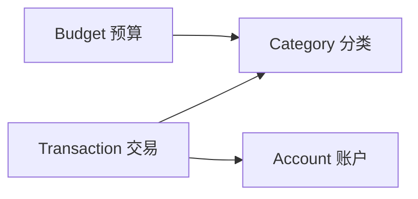

<div align="center">

# 💰 ExpenseTracker

**现代化的 iOS 个人财务管理应用**

[](https://swift.org)
[](https://www.apple.com/ios)
[](https://developer.apple.com/xcode/swiftui/)
[](https://developer.apple.com/xcode/swiftdata/)
[](LICENSE)

<p align="center">
  
  
  
</p>

[功能特性](#-功能特性) • [快速开始](#-快速开始) • [技术架构](#-技术架构) • [项目结构](#-项目结构) • [开发指南](#-开发指南)

</div>

---

## ✨ 功能特性

### 📊 核心功能

<table>
<tr>
<td width="50%">

#### 💸 智能记账
- ✅ 快速记录收入/支出
- 🏷️ 自定义分类与图标
- 💳 多账户管理支持
- 📝 详细备注与商户信息
- ⌨️ 自定义数字键盘

</td>
<td width="50%">

#### 📈 数据统计
- 📊 多维度数据分析
- 📅 按日/周/月/年统计
- 🎨 可视化图表展示
- 🔍 分类交易明细查询
- 💯 收支双列徽标显示

</td>
</tr>
<tr>
<td width="50%">

#### 🎯 预算管理
- 💰 设置月度预算
- ⚠️ 超支预警提醒
- 📉 预算执行进度追踪
- 🎚️ 灵活的预算调整

</td>
<td width="50%">

#### ⚙️ 个性化设置
- 🎨 自定义分类颜色
- 🖼️ 丰富的图标库
- 🌓 深色/浅色模式
- 💾 本地数据存储
- 🔐 隐私安全保护

</td>
</tr>
</table>

---

## 🚀 快速开始

### 环境要求

- macOS 14.0+
- Xcode 15.0+
- iOS 17.0+ (模拟器或真机)
- Swift 5.9+

### 安装步骤

1. **克隆仓库**
   ```bash
   git clone https://github.com/yourusername/ExpenseTracker.git
   cd ExpenseTracker
   ```

2. **打开项目**
   ```bash
   open ExpenseTracker.xcodeproj
   ```

3. **运行应用**
   - 在 Xcode 中选择目标设备
   - 点击运行按钮 (⌘R) 或选择 `Product → Run`

### 命令行构建

```bash
# 清理并构建
xcodebuild -scheme ExpenseTracker \
           -destination 'platform=iOS Simulator,name=iPhone 15' \
           clean build

# 运行测试
xcodebuild test -scheme ExpenseTracker \
                -destination 'platform=iOS Simulator,name=iPhone 15'
```

---

## 🏗️ 技术架构

### 核心技术栈

| 技术 | 用途 | 版本 |
|------|------|------|
| **SwiftUI** | 声明式 UI 框架 | 5.0+ |
| **SwiftData** | 数据持久化 | iOS 17+ |
| **Combine** | 响应式编程 | - |
| **SF Symbols** | 系统图标库 | 5.0 |

### 架构设计

```
ExpenseTracker
├── 🎯 MVVM 架构模式
├── 🗂️ 模块化特性组织
├── 💾 SwiftData 本地存储
├── 🔄 响应式数据绑定
└── 🎨 原生 SwiftUI 组件
```

### 数据模型关系



---

## 📁 项目结构

```
ExpenseTracker/
├── 📱 App/                          # 应用入口
│   ├── ExpenseTrackerApp.swift     # 主应用文件
│   └── ContentView.swift            # 根视图与导航
│
├── ✨ Features/                     # 功能模块
│   ├── 💰 Transactions/             # 交易管理
│   │   ├── Models/                  # 数据模型
│   │   │   └── Transaction.swift
│   │   └── Views/                   # 视图组件
│   │       ├── EditTransactionView.swift
│   │       └── CustomNumericKeyboard.swift
│   │
│   ├── ⚙️  Settings/                # 设置管理
│   │   ├── Models/                  # 账户与分类模型
│   │   │   ├── Account.swift
│   │   │   └── Category.swift
│   │   └── Views/                   # 设置界面
│   │       ├── CategoryManagementView.swift
│   │       ├── AddCategoryView.swift
│   │       ├── EditCategoryView.swift
│   │       ├── ColorPickerView.swift
│   │       └── IconPickerView.swift
│   │
│   ├── 📊 Statistics/               # 数据统计
│   │   ├── Models/
│   │   │   └── StatisticsModels.swift
│   │   ├── Services/
│   │   │   └── StatisticsService.swift
│   │   └── Views/
│   │       ├── StatisticsView.swift
│   │       ├── StatisticsSummaryCard.swift
│   │       ├── CategoryStatisticsRow.swift
│   │       ├── PeriodSelectorView.swift
│   │       └── CategoryTransactionListView.swift
│   │
│   └── 🎯 Budget/                   # 预算管理
│       └── Models/
│           └── Budget.swift
│
├── 🔧 Shared/                       # 共享组件
│   ├── Components/                  # 通用UI组件
│   ├── Extensions/                  # 扩展方法
│   └── Utilities/                   # 工具类
│
└── 🎨 Resources/                    # 资源文件
    └── Assets.xcassets/             # 图片与颜色资源
```

---

## 💡 核心功能实现

### 1️⃣ 交易记录

```swift
// 支持完整的CRUD操作
Transaction(
    amount: 99.99,
    type: .expense,
    date: Date(),
    note: "午餐",
    merchant: "星巴克",
    category: 餐饮分类,
    account: 支付宝账户
)
```

**特性：**
- 自动时间戳记录
- 分类与账户关联
- 格式化金额显示（¥ 符号）
- 收入/支出类型区分

### 2️⃣ 数据统计

```swift
// 多时间维度统计
- 日统计：当日收支概览
- 周统计：本周收支趋势
- 月统计：月度财务分析
- 年统计：年度财务报表
```

**功能：**
- 分类支出占比分析
- 收支趋势可视化
- 交易明细深度钻取
- 实时数据刷新

### 3️⃣ 分类管理

- 🎨 **16 种预设颜色**
- 🖼️ **100+ SF Symbols 图标**
- 🏷️ **收入/支出分类独立管理**
- ✏️ **自由编辑与删除**

### 4️⃣ 数据持久化

```swift
// SwiftData 配置
ModelContainer(
    for: Transaction.self,
         Category.self,
         Budget.self,
         Account.self,
    configurations: ModelConfiguration(
        cloudKitDatabase: .none  // 本地存储
    )
)
```

---

## 👨‍💻 开发指南

### 代码规范

- **命名约定**：大驼峰（类型）、小驼峰（属性/方法）
- **缩进风格**：4 空格缩进
- **注释语言**：中文注释，清晰明了
- **文件命名**：视图以 `View` 结尾，模型以实体名结尾

### 提交规范

```bash
feat: 新增功能
fix: 修复缺陷
chore: 构建/工具链
docs: 文档更新
test: 测试相关
```

**示例：**
```bash
git commit -m "feat: 新增分类统计饼图展示"
git commit -m "fix: 修复统计区间金额计算错误"
```

### 测试指南

```bash
# 单元测试
Tests/UnitTests/*Tests.swift

# UI 测试
Tests/UITests/*UITests.swift

# 运行测试
xcodebuild test -scheme ExpenseTracker \
                -destination 'platform=iOS Simulator,name=iPhone 15'
```

**测试要求：**
- ✅ 新增功能必须包含单元测试
- ✅ UI 改动需要验证主要路径
- ✅ 提交前本地跑通所有测试

---

## 🤝 贡献指南

我们欢迎所有形式的贡献！

### 贡献流程

1. **Fork 项目**
2. **创建特性分支** (`git checkout -b feature/AmazingFeature`)
3. **提交更改** (`git commit -m 'feat: 添加某个很棒的功能'`)
4. **推送到分支** (`git push origin feature/AmazingFeature`)
5. **提交 Pull Request**

### PR 检查清单

- [ ] 代码遵循项目规范
- [ ] 添加了必要的测试
- [ ] 更新了相关文档
- [ ] 所有测试通过
- [ ] 没有引入新的警告
- [ ] UI 改动附带截图

---

## 📋 路线图

### ✅ 已完成

- [x] 基础交易记录功能
- [x] 分类与账户管理
- [x] 多维度数据统计
- [x] 自定义分类样式
- [x] 预算管理基础框架

### 🚧 进行中

- [ ] 统计图表可视化增强
- [ ] 数据导出功能（CSV/Excel）
- [ ] 重复交易模板
- [ ] 多币种支持

### 🔮 规划中

- [ ] iCloud 云同步
- [ ] Widget 小组件
- [ ] 数据备份/恢复
- [ ] Face ID / Touch ID 保护
- [ ] 账单提醒功能
- [ ] 财务报表生成

---

## 📄 许可证

本项目采用 MIT 许可证 - 详见 [LICENSE](LICENSE) 文件

---

## 👤 作者

**xiaolei**

- 💼 资深 iOS 开发工程师
- 📧 Email: [your-email@example.com](mailto:your-email@example.com)
- 🔗 GitHub: [@yourusername](https://github.com/yourusername)

---

## 🙏 致谢

感谢以下技术和工具：

- [SwiftUI](https://developer.apple.com/xcode/swiftui/) - Apple 官方 UI 框架
- [SwiftData](https://developer.apple.com/xcode/swiftdata/) - Apple 数据持久化框架
- [SF Symbols](https://developer.apple.com/sf-symbols/) - Apple 图标库

---

<div align="center">

### ⭐ 如果这个项目对你有帮助，请给个 Star！⭐

**让记账变得简单而优雅**

[回到顶部](#-expensetracker) | [报告问题](https://github.com/yourusername/ExpenseTracker/issues) | [功能建议](https://github.com/yourusername/ExpenseTracker/issues/new)

---

Made with ❤️ by xiaolei | © 2025 ExpenseTracker

</div>
